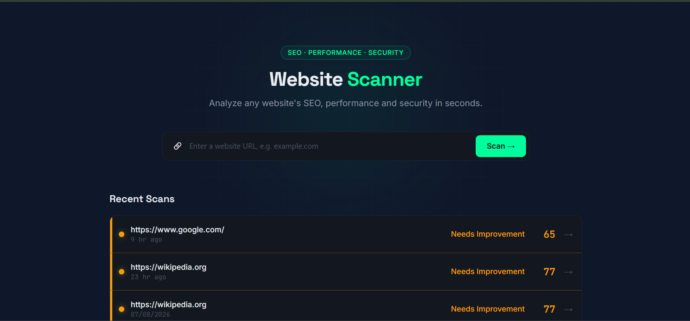
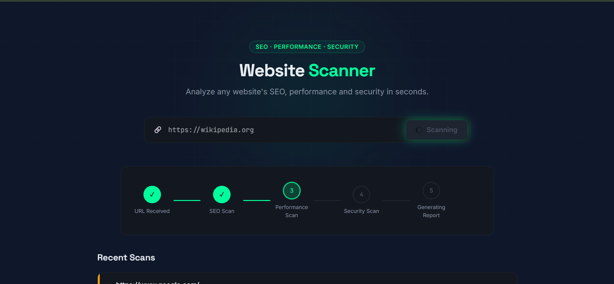
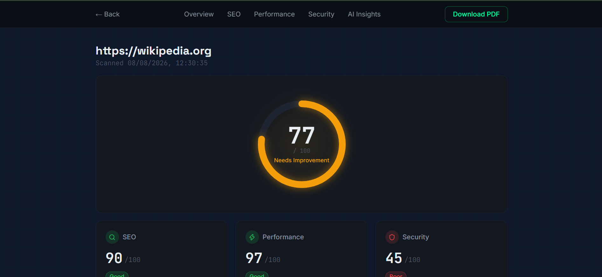
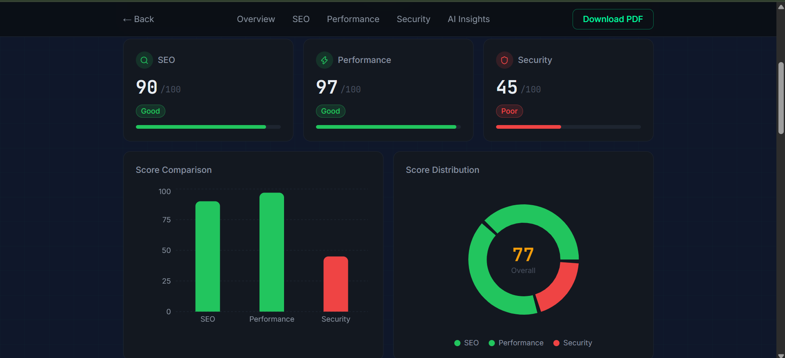
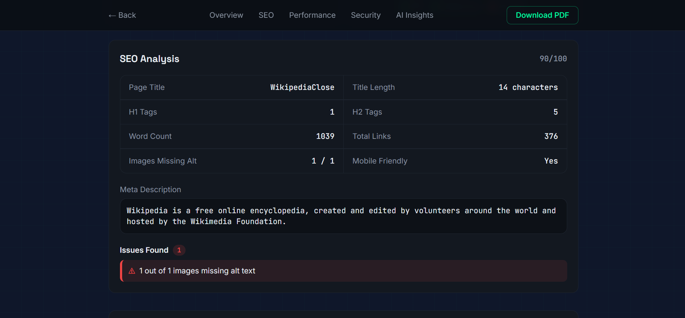
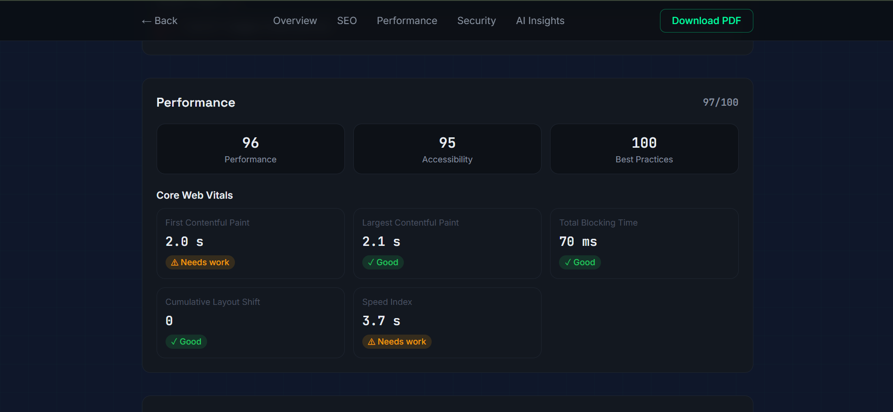
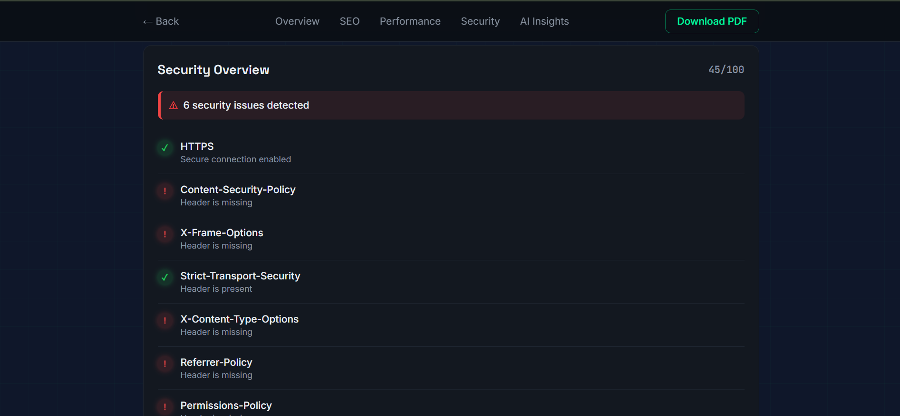
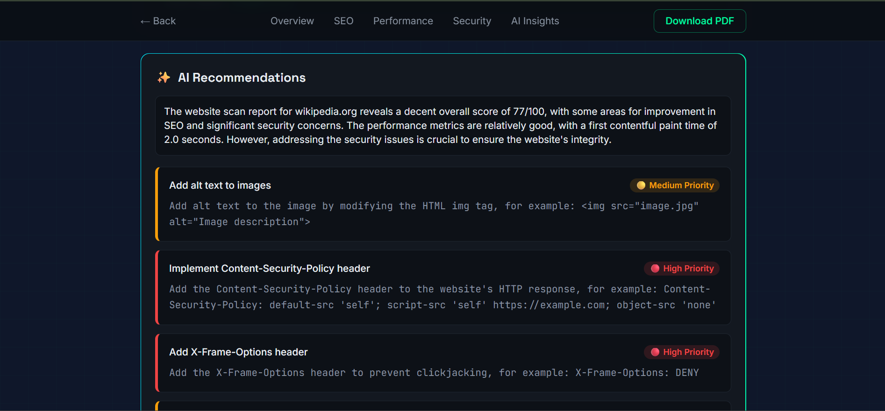
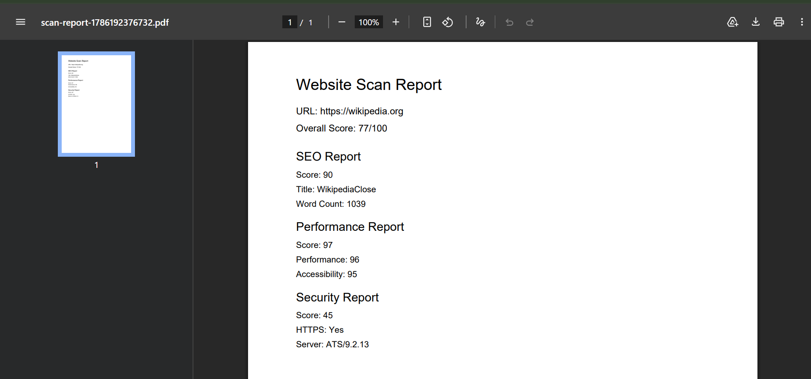

<div align="center">

# 🔍 Website Scanner

### AI-Powered SEO, Performance & Security Audit Tool

Analyze any website's **SEO health**, **performance metrics**, and **security posture** in seconds — complete with AI-generated fix recommendations, live scan progress tracking, and downloadable PDF reports.

[](https://react.dev/)
[](https://nodejs.org/)
[](https://www.sqlite.org/)
[](https://groq.com/)
[](LICENSE)

### 🌐 [**Live Demo →**](https://website-scanner-brown-iota.vercel.app/)

</div>

---

## 📌 Table of Contents

- [Live Demo](#-live-demo)
- [The Problem](#-the-problem)
- [The Solution](#-the-solution)
- [Key Features](#-key-features)
- [Screenshots](#-screenshots)
- [Tech Stack](#-tech-stack)
- [Architecture & Workflow](#-architecture--workflow)
- [Project Structure](#-project-structure)
- [Getting Started](#-getting-started)
- [Environment Variables](#-environment-variables)
- [API Reference](#-api-reference)
- [Roadmap](#-roadmap)
- [License](#-license)

---

## 🌐 Live Demo

**Try it now:** [https://website-scanner-brown-iota.vercel.app/](https://website-scanner-brown-iota.vercel.app/)

> ⚠️ **Note:** The backend is hosted on Render's free tier, which spins down after periods of inactivity. The **first scan** after inactivity may take 30–60 seconds extra to "wake up" the server — subsequent scans will be fast. This is a free-tier limitation, not a bug.

---

## 🧩 The Problem

Most websites — especially those built by individual developers, small businesses, or students — are shipped without ever being checked for:

- **SEO fundamentals** (missing titles, meta descriptions, alt text, heading structure)
- **Performance issues** (slow load times, poor Core Web Vitals, unoptimized assets)
- **Security hygiene** (missing HTTP security headers, no HTTPS, exposed server info)

Existing tools like Lighthouse, GTmetrix, or SecurityHeaders.com check these **individually**, forcing users to juggle multiple tools and manually piece together an action plan. There's no single, beginner-friendly dashboard that combines all three **and** tells you exactly how to fix what's wrong.

## 💡 The Solution

**Website Scanner** takes a single URL and runs it through three parallel analysis engines — SEO, Performance, and Security — then aggregates the results into one unified score and dashboard. On top of that, it uses **Groq's LLaMA 3.3 70B model** to read the scan results and generate prioritized, human-readable fixes — turning raw audit data into an actionable checklist.

It's built to feel like a real security-scanning product: live stage-by-stage scan progress, animated score gauges, and a dark "radar/terminal" themed interface — not just another CRUD dashboard.

---

## ✨ Key Features

- 🔎 **SEO Analysis** — title/meta tags, heading structure, alt text coverage, word count, mobile-friendliness
- ⚡ **Performance Audit** — powered by Google PageSpeed Insights (Lighthouse), tracks Core Web Vitals (FCP, LCP, CLS, TBT, Speed Index)
- 🛡️ **Security Hygiene Check** — HTTPS validation and HTTP security headers (CSP, HSTS, X-Frame-Options, etc.) — fully passive, non-intrusive checks
- 🤖 **AI-Generated Fixes** — Groq LLaMA 3.3 analyzes issues and returns prioritized, actionable solutions with code snippets
- 📡 **Live Scan Progress** — real-time stage-by-stage tracking via Server-Sent Events (URL Received → SEO → Performance → Security → Report)
- 📊 **Interactive Dashboard** — animated score gauge, bar chart & donut chart score breakdowns
- 📄 **PDF Report Export** — download a clean, shareable scan report
- 🕘 **Scan History** — every scan is persisted to SQLite and browsable later

---

## 🖼️ Screenshots

<table>
<tr>
<td width="50%">

**1. Home — Scan Input**

Landing page with the URL input bar and a list of recent scans, each color-coded by score status (Good / Needs Improvement / Poor).

</td>
<td width="50%">

**2. Live Scan Progress**

Real-time node-based progress flow, streamed via Server-Sent Events, showing each scan stage completing live — URL received, SEO scan, performance scan, and so on.

</td>
</tr>
<tr>
<td width="50%">

**3. Report Overview — Score Gauge**

The report page's hero section: an animated circular gauge showing the overall score, with individual SEO / Performance / Security sub-scores below it.

</td>
<td width="50%">

**4. Score Comparison & Distribution Charts**

A bar chart comparing SEO, Performance, and Security scores side by side, plus a donut chart showing overall score distribution.

</td>
</tr>
<tr>
<td width="50%">

**5. SEO Analysis Breakdown**

Detailed SEO metrics — page title, meta description, heading counts, word count, and a list of detected issues with severity indicators.

</td>
<td width="50%">

**6. Performance — Core Web Vitals**

Individual metric cards for First Contentful Paint, Largest Contentful Paint, Total Blocking Time, Cumulative Layout Shift, and Speed Index, each with a Good/Needs Work rating.

</td>
</tr>
<tr>
<td width="50%">

**7. Security Overview**

A checklist of HTTP security headers (HTTPS, CSP, HSTS, X-Frame-Options, etc.) with pass/fail indicators and a summary of total issues detected.

</td>
<td width="50%">

**8. AI-Generated Recommendations**

Groq-powered AI analysis of all detected issues, returned as prioritized (High/Medium/Low) fix cards with concrete, code-level solutions.

</td>
</tr>
<tr>
<td width="50%" colspan="2">

**9. Downloadable PDF Report**

A clean, exportable PDF summary of the entire scan — URL, overall score, and a breakdown of SEO, Performance, and Security results — generated client-side with jsPDF.

</td>
</tr>
</table>

---

## 🛠️ Tech Stack

| Layer | Technology | Purpose |
|---|---|---|
| **Frontend** | React 19 (Vite) | Component-based UI |
| **Routing** | React Router | Client-side navigation between Home & Report pages |
| **Styling** | Tailwind CSS 4 | Utility-first dark "radar" theme |
| **Charts** | Recharts | Bar & donut score visualizations |
| **Icons** | Lucide React | Consistent outline icon set |
| **PDF Export** | jsPDF | Client-side report generation |
| **Backend** | Node.js + Express | REST API & scan orchestration |
| **HTML Parsing** | Cheerio | SEO data extraction from raw HTML |
| **HTTP Client** | Axios | Fetching target websites & calling external APIs |
| **Performance Engine** | Google PageSpeed Insights API | Lighthouse-based performance/accessibility scoring |
| **AI Engine** | Groq API (LLaMA 3.3 70B Versatile) | Issue analysis & fix generation |
| **Database** | SQLite | Lightweight scan history persistence |
| **Real-time Updates** | Server-Sent Events (SSE) | Live scan stage streaming |

---

## 🏗️ Architecture & Workflow

```
                              USER
                               │
                               ▼
                     Enter Website URL
                               │
                               ▼
                      React Frontend (Vite)
                               │
                 GET /api/scan-stream (SSE)
                               │
                               ▼
                     Node.js + Express Backend
                               │
             ┌─────────────────┼─────────────────┐
             ▼                 ▼                 ▼
        SEO Engine      Performance Engine   Security Engine
             │                 │                 │
        Axios + Cheerio   PageSpeed API     HTTP Header Analysis
        (HTML parsing)    (Lighthouse)      (CSP, HSTS, etc.)
             │                 │                 │
             └─────────────────┼─────────────────┘
                               ▼
                      Result Aggregator
                    (weighted overall score)
                               │
                    ┌──────────┴──────────┐
                    ▼                     ▼
              Save to SQLite       Stream to Frontend
                                          │
                                          ▼
                                 React Dashboard
                          (Score Gauge, Charts, Reports)
                                          │
                                          ▼
                          POST /api/ai-analysis/:id
                                          │
                                          ▼
                              Groq LLaMA 3.3 70B
                        (Assessment + Prioritized Fixes)
```

**Flow summary:**
1. User submits a URL from the React frontend.
2. Backend opens an SSE connection and runs SEO, Performance, and Security checks (SEO & Security in parallel where possible; Performance via PageSpeed).
3. Each stage streams its status back live, driving the animated progress UI.
4. Once all three complete, results are aggregated into an overall score and saved to SQLite.
5. The frontend renders the full report — score gauge, charts, and per-category breakdowns.
6. On request, the report is sent to Groq's LLaMA 3.3 model, which returns a structured JSON of prioritized, actionable fixes.

---

## 📂 Project Structure

```
Website-Scanner/
│
├── Assets/                        # README screenshots
│   ├── Img1.png … Img9.png
│
├── client/                        # React frontend (Vite)
│   ├── public/
│   │   └── WebScannerFavicon.svg
│   └── src/
│       ├── components/
│       │   ├── UrlInputForm.jsx
│       │   ├── ProcessFlow.jsx
│       │   ├── ScoreCard.jsx
│       │   ├── ScoreChart.jsx
│       │   ├── ScanHistory.jsx
│       │   ├── SeoReport.jsx
│       │   ├── PerformanceReport.jsx
│       │   ├── SecurityReport.jsx
│       │   ├── AISolutions.jsx
│       │   └── LoadingSpinner.jsx
│       ├── pages/
│       │   ├── Home.jsx
│       │   └── ReportPage.jsx
│       ├── services/
│       │   └── api.js             # Axios + SSE calls to backend
│       ├── utils/
│       │   ├── generatePDF.js     # jsPDF report export
│       │   └── scoreUtils.js      # Shared score → status/color mapping
│       ├── App.jsx
│       ├── main.jsx
│       └── index.css
│
├── server/                        # Node.js + Express backend
│   ├── config/
│   │   └── config.js
│   ├── controllers/
│   │   └── scanController.js      # Route handlers + SSE streaming logic
│   ├── db/
│   │   └── database.js            # SQLite connection & schema
│   ├── models/
│   │   └── scanModel.js           # DB read/write operations
│   ├── routes/
│   │   └── scanRoutes.js
│   ├── services/
│   │   ├── seoService.js          # Cheerio-based SEO analysis
│   │   ├── performanceService.js  # PageSpeed Insights integration
│   │   ├── securityService.js     # HTTP header analysis
│   │   └── groqService.js         # Groq AI fix generation
│   ├── .env.example
│   └── server.js
│
├── LICENSE
└── README.md
```

---

## 🚀 Getting Started

### Prerequisites

- [Node.js](https://nodejs.org/) v18 or higher
- npm (comes with Node.js)
- Free API keys for:
  - [Google PageSpeed Insights API](https://console.cloud.google.com/)
  - [Groq Console](https://console.groq.com/)

### 1. Clone the repository

```bash
git clone https://github.com/<your-username>/Website-Scanner.git
cd Website-Scanner
```

### 2. Set up the backend

```bash
cd server
npm install
```

Create a `.env` file in `server/` (use `.env.example` as a template):

```env
PORT=5000
PAGESPEED_API_KEY=your_pagespeed_api_key_here
GROQ_API_KEY=your_groq_api_key_here
```

Start the backend server:

```bash
npm run dev
```

The API will run at `http://localhost:5000`.

### 3. Set up the frontend

Open a new terminal:

```bash
cd client
npm install
npm run dev
```

The app will run at `http://localhost:5173`.

### 4. Start scanning 🎉

Open `http://localhost:5173` in your browser, enter any website URL, and watch the live scan progress in action.

---

## 🔑 Environment Variables

| Variable | Description | Where to get it |
|---|---|---|
| `PORT` | Backend server port (default `5000`) | — |
| `PAGESPEED_API_KEY` | Enables Lighthouse-based performance scoring | [Google Cloud Console](https://console.cloud.google.com/) → Enable "PageSpeed Insights API" → Create API Key |
| `GROQ_API_KEY` | Enables AI-generated fix recommendations | [console.groq.com](https://console.groq.com/) → API Keys → Create Key |

> Both APIs are free — PageSpeed Insights offers 25,000 requests/day, and Groq's free tier is generous for personal/portfolio use.

---

## 📡 API Reference

| Method | Endpoint | Description |
|---|---|---|
| `GET` | `/api/scan-stream?url=<url>` | Runs a full scan and streams live progress via SSE |
| `POST` | `/api/scan` | Runs a full scan and returns the complete result (non-streaming) |
| `GET` | `/api/history` | Returns all past scans |
| `GET` | `/api/scan/:id` | Returns a single scan by ID |
| `POST` | `/api/ai-analysis/:id` | Generates AI-powered fix recommendations for a given scan |

---

## ☁️ Deployment

This project is deployed using a split-hosting approach:

| Service | Platform | Notes |
|---|---|---|
| **Frontend** | [Vercel](https://vercel.com/) | Auto-deploys from `client/` on every push to `main` |
| **Backend** | [Render](https://render.com/) | Free-tier web service, auto-deploys from `server/` |

Both platforms are connected to this GitHub repository and redeploy automatically on every push. To deploy your own copy:

1. **Backend (Render):** Create a new Web Service, set Root Directory to `server`, add your environment variables (`PAGESPEED_API_KEY`, `GROQ_API_KEY`, `NODE_VERSION=20.18.0`), and deploy.
2. **Frontend (Vercel):** Import the repo, set Root Directory to `client`, add `VITE_API_URL` pointing to your Render backend URL (with `/api` suffix), and deploy.

---

## 🗺️ Roadmap

- [x] Deploy live demo (Vercel + Render)
- [ ] User authentication for private scan history
- [ ] Scheduled/recurring scans with email alerts
- [ ] Competitor comparison mode (scan multiple URLs side by side)
- [ ] Export report as shareable public link

---

## 📄 License

This project is licensed under the [MIT License](LICENSE).

---

<div align="center">

**Built as a hands-on project to demonstrate full-stack development, third-party API integration, and AI-assisted product design.**

</div>